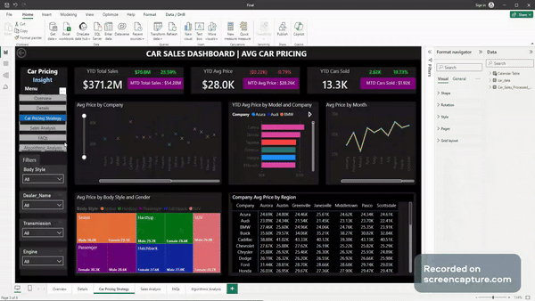

# Car Sales Analysis PowerBI Dashboard

Welcome to the README for the Car Sales Analysis PowerBI Dashboard project. This dashboard provides insights and analysis of car sales data.

## Contents
1. [Introduction](#introduction)
2. [Files Overview](#files-overview)
3. [Installation and Setup](#installation-and-setup)
4. [Usage](#usage)
5. [Demo](#demo)
6. [License](#license)

## Introduction
The Car Sales Analysis PowerBI Dashboard is designed to provide visualizations and analysis of car sales data. It utilizes PowerBI to create interactive and insightful dashboards.

## Files Overview
- **Car Sales Analysis (PowerBI Dashboard).pptx**: Presentation slides providing an overview of the dashboard project.
- **Car Sales Dashboard.pbix**: The PowerBI dashboard file containing the visualizations and analysis.
- **Car Sales.xlsx**: Original car sales data used for the analysis.
- **Car_Sales_Processed_Data.csv**: Processed car sales data used in the PowerBI dashboard.
- **Power_BI_Python Script_Model.ipynb**: Jupyter Notebook containing Python scripts used for data processing or modeling.
- **Problem Statement.docx**: Document outlining the problem statement and objectives of the project.

## Installation and Setup
To run the Car Sales Analysis PowerBI Dashboard, follow these steps:
1. Download or clone the repository.
2. Open the PowerBI desktop application.
3. Open the **Car Sales Dashboard.pbix** file.
4. Ensure that the data sources are correctly configured to point to the **Car Sales.xlsx** or **Car_Sales_Processed_Data.csv** file.
5. Refresh the data to update the dashboard with the latest data.
6. Interact with the dashboard to explore the insights and analysis.

## Usage
- Open the PowerBI dashboard file (**Car Sales Dashboard.pbix**) in the PowerBI desktop application.
- Navigate through different visualizations and filters to explore the car sales data.
- Refer to the presentation slides (**Car Sales Analysis (PowerBI Dashboard).pptx**) for an overview of the dashboard project and its findings.

## Demo

  

For the full demonstration, please check the [Car Sales Analysis Screen Recording.mp4](link_to_your_video) file.

## License
This project is licensed under the [MIT License](LICENSE).

Thank you for your interest in the Car Sales Analysis PowerBI Dashboard project!
